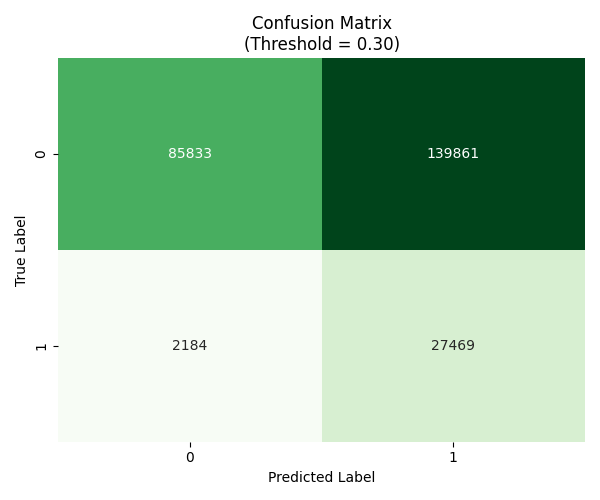
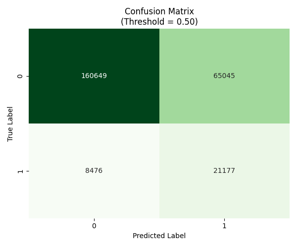

# AI-Powered Credit Risk Prediction System (Stacking Ensemble)

## Project Overview

This project demonstrates an advanced Credit Risk Assessment System designed to predict loan defaults with high precision in financial lending environments. It utilizes a sophisticated Stacking Ensemble architecture that combines the distinct predictive strengths of XGBoost, Random Forest, and Gradient Boosting machines. By leveraging multiple algorithmic perspectives, this approach allows the system to capture both linear dependencies and complex, non-linear patterns in borrower behavior, offering superior performance and robustness compared to traditional single-model solutions.

The system features a deployment-ready Streamlit interface that categorizes applicants into three actionable risk tiers (Low, Medium, High) and includes automated business policy guardrails to ensure regulatory compliance before AI inference occurs.

**Dataset Source:** [Loan Default Prediction Dataset on Kaggle](https://www.kaggle.com/datasets/nikhil1e9/loan-default)

## System Architecture

The machine learning pipeline follows a strict operational workflow designed for reliability and performance:

1.  **Data Ingestion:** Loads raw loan data including demographic information, financial status, existing debt obligations, and credit history metrics.
2.  **Feature Engineering:** Transforms raw data into powerful predictive signals to expose hidden risk factors, such as specific interaction effects between income levels and credit scores.
3.  **Preprocessing:** Applies Synthetic Minority Over-sampling (SMOTE) during training to generate synthetic examples of default cases. This is crucial to prevent the model from becoming biased toward the majority class (non-defaulters), ensuring it learns to identify rare default events accurately.
4.  **Ensemble Training:**
    * **Base Learners (Level 0):** XGBoost, Random Forest, and Gradient Boosting models are trained independently to learn different aspects of the data structure.
    * **Meta Learner (Level 1):** A Logistic Regression model is trained on the outputs of the base learners, effectively learning the optimal way to weight and combine their predictions to produce a final, calibrated probability score.
5.  **Inference:** The web dashboard applies hard-coded business policy guardrails (e.g., minimum age requirements) before running the data through the AI model for real-time risk assessment.

## Technologies and Libraries Used

The project is built using a robust stack of Python-based data science and machine learning libraries:

* **Core Language:** Python 3.9+
* **Data Manipulation:** Pandas, NumPy
* **Machine Learning:** Scikit-learn (Logistic Regression, Random Forest, StackingClassifier)
* **Gradient Boosting:** XGBoost
* **Imbalanced Data Handling:** Imbalanced-learn (SMOTE for synthetic oversampling)
* **Visualization:** Matplotlib, Seaborn
* **Model Interpretability:** SHAP (SHapley Additive exPlanations)
* **Web Framework:** Streamlit (for the interactive dashboard)
* **Model Persistence:** Joblib

## Data Dictionary

The model is trained on a comprehensive dataset containing **18 columns**, representing a mix of demographic details, financial health indicators, and loan characteristics.

| # | Column Name | Description |
| :--- | :--- | :--- |
| 1 | **LoanID** | A unique identifier for each loan application (removed during training to prevent data leakage). |
| 2 | **Age** | The age of the applicant in years. |
| 3 | **Income** | The annual income of the applicant in dollars. |
| 4 | **LoanAmount** | The total principal amount requested for the loan. |
| 5 | **CreditScore** | The applicant's credit score (e.g., FICO), ranging from 300 to 850. |
| 6 | **MonthsEmployed** | The number of months the applicant has been continuously employed. |
| 7 | **NumCreditLines** | The total number of open credit lines (credit cards, loans) in the applicant's history. |
| 8 | **InterestRate** | The interest rate assigned to the loan based on initial risk assessment. |
| 9 | **LoanTerm** | The duration of the loan repayment period in months. |
| 10 | **DTIRatio** | Debt-to-Income Ratio: The percentage of monthly income that goes toward paying debts. |
| 11 | **Education** | The highest level of education attained (High School, Bachelor's, Master's, PhD). |
| 12 | **EmploymentType** | The nature of employment (Full-time, Part-time, Self-employed, Unemployed). |
| 13 | **MaritalStatus** | The applicant's marital status (Single, Married, Divorced). |
| 14 | **HasMortgage** | Binary indicator (Yes/No) representing if the applicant currently has a mortgage. |
| 15 | **HasDependents** | Binary indicator (Yes/No) representing if the applicant has financial dependents. |
| 16 | **LoanPurpose** | The stated reason for the loan (Business, Home, Education, Auto, Other). |
| 17 | **HasCoSigner** | Binary indicator (Yes/No) representing if there is a co-signer to guarantee the loan. |
| 18 | **Default** | **Target Variable:** 0 indicates the loan was repaid; 1 indicates a default occurred. |

## Feature Engineering Logic

The model's predictive power is significantly enhanced by several engineered features derived from domain knowledge:

* **Credit-Income Interaction:** A mathematical interaction term (`CreditScore * log(Income)`) used to identify high-income individuals with poor credit history, flagging them as high behavioral risks despite their apparent capacity to pay.
* **Strict Debt-to-Income (DTI):** A recalibrated DTI metric that includes estimated monthly obligations and subsistence costs, providing a more realistic view of an applicant's disposable income.
* **Tenure-Age Ratio:** Measures employment stability relative to the applicant's age, helping to distinguish between early-career instability and long-term employment gaps.
* **Age Binning:** Segments applicants into generational buckets (e.g., 18-25, 26-35) to capture demographic risk trends that vary across different life stages.

## Key Results

The Stacking Ensemble approach demonstrated superior performance compared to individual baseline models. By combining weak and strong learners, the system achieved:

* **Robust Discrimination:** The model achieved a high Area Under the ROC Curve (AUC), indicating excellent capability in distinguishing between defaulters and non-defaulters across all probability thresholds.
* **Optimized F1-Score:** Through threshold tuning, the operational point was adjusted to maximize the F1-Score, balancing Precision (minimizing false rejections) and Recall (capturing true defaults).
* **Stability:** The ensemble method significantly reduced variance, making the model less prone to overfitting on outliers compared to a standalone Decision Tree or Random Forest.

## Visualization & Performance Analysis

A critical component of any financial AI system is the ability to validate its decisions and understand its operating thresholds. This project generates detailed analytics to define the trade-off between risk (approving bad loans) and opportunity (rejecting good customers).

### Confusion Matrices (Threshold Strategy Analysis)

In credit risk modeling, a single decision threshold (like 50%) is rarely sufficient for real-world operations. Different economic conditions require different risk appetites. To address this, we analyze the model's performance across three distinct operational strategies. The "Aggressive" threshold (0.30) represents a highly risk-averse strategy, prioritizing capital preservation by rejecting any applicant with even a moderate probability of default; this minimizes bad debt but significantly increases "false alarms," rejecting many good customers. The "Balanced" threshold (0.50) represents the standard mathematical cutoff, which is often suboptimal in finance where the cost of a default far exceeds the profit from a good loan. Finally, the "Optimized" threshold is mathematically derived to maximize the F1-Score, representing the ideal operational "sweet spot" that balances the competing goals of maximizing revenue from good loans while minimizing capital losses from defaults.

**Aggressive Threshold (0.30) - High Safety focus**

**Balanced Threshold (0.50) - Standard Cutoff**

**Optimized Threshold (F1-Max) - Profit Maximization focus**

### ROC Curve (Receiver Operating Characteristic)

The ROC Curve is the fundamental metric for evaluating the quality of a binary classification model, independent of any specific decision threshold. It plots the True Positive Rate (Recall, or how many defaulters we catch) against the False Positive Rate (how many good people we incorrectly flag as risky) at every conceivable probability cutoff. The Area Under the Curve (AUC) provides a single summary score of the model's discriminative power. A perfect model would have an AUC of 1.0, meaning it perfectly separates safe borrowers from risky ones with zero overlap. The high AUC achieved by this stacking ensemble indicates excellent separability, meaning the model rarely confuses a highly safe borrower with a high-risk applicant.

### Threshold Tuning Curve (Precision-Recall Trade-off)

This visualization illustrates the inherent tension in binary classification: you generally cannot maximize both Precision (the accuracy of your rejections) and Recall (the percentage of total defaulters you catch) simultaneously. As you lower the decision threshold to catch more bad loans (increasing Recall), you inevitably start sweeping up more good customers in your net (decreasing Precision). This plot visualizes these opposing forces across all probability thresholds. The red dotted line marks the mathematically optimal point—the peak of the F1-Score curve—which defines the exact threshold used in our "Optimized" strategy above. This provides data-driven justification for the operational cutoff point used in the deployment dashboard.

### SHAP Summary (Model Explainability)

In regulated financial industries, it is not enough for a model to be accurate; it must also be explainable. We use SHAP (SHapley Additive exPlanations) to tear down the "black box" of the ensemble model. This summary plot reveals the global importance of every feature and how its values influence the final risk score. Features are listed vertically by overall importance. For each feature, every dot represents a single applicant. The color indicates the actual value of that feature (Red = High value, Blue = Low value), and the horizontal position indicates its impact on the prediction (Right side = pushes risk higher, Left side = pushes risk lower). For example, observing that low Credit Scores (blue dots) cluster heavily on the far right confirms the model is correctly prioritizing credit history as a major risk driver.

---

## Accessing the Application

The trained model is hosted on Streamlit Cloud. You can access the live dashboard using the link below to test predictions on real-time data:

**Live App:** [https://share.streamlit.io/your-username/your-repo-name](https://share.streamlit.io/your-username/your-repo-name)